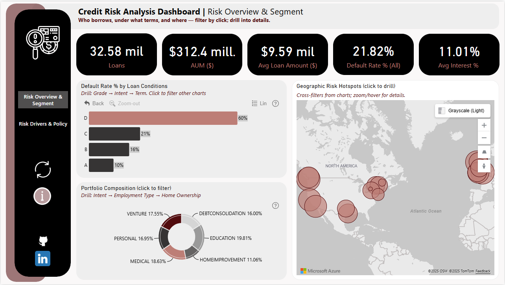
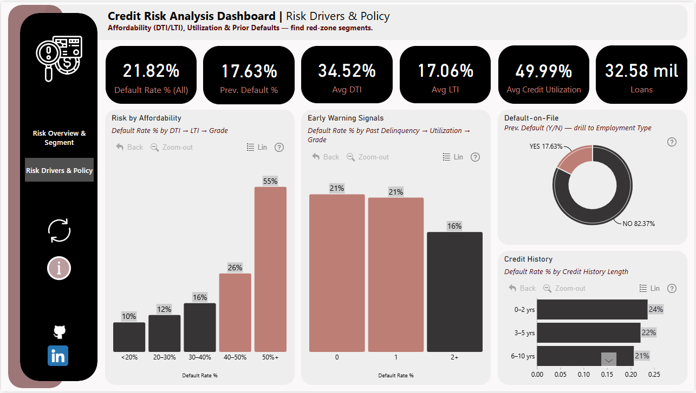
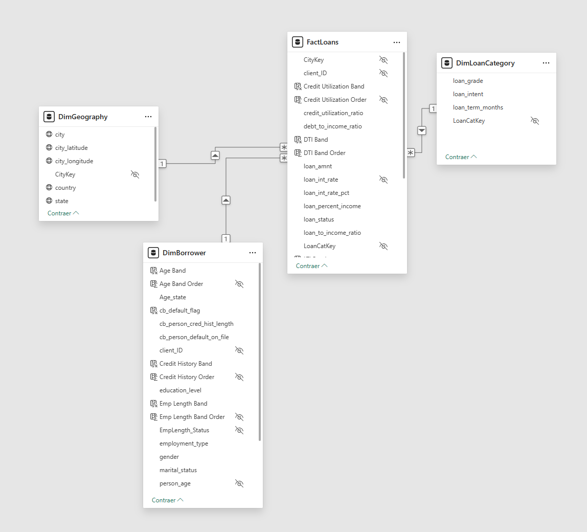

# 🏦 Credit Risk Analytics — Nova Bank
**Exploring credit risk behavior to balance inclusion and financial control.**

This project analyzes borrower risk patterns using Power BI to uncover *who tends to default, under what conditions, and where*.  
It demonstrates how analytics can support more informed, data-driven lending policies without excluding good customers.

---

## 🧩 Problem Statement
Nova Bank provides personal, medical, education, and business loans across the USA, UK, and Canada.  
The challenge is to **balance financial inclusion with risk control** — approving too many high-risk loans leads to losses, but being too restrictive limits growth and accessibility.  

The goal was to:
- Identify **borrower and loan characteristics** linked to higher default rates.  
- Understand **geographic and behavioral patterns** of risk.  
- Provide **actionable insights** to refine lending rules and credit policies.

---

## 📊 Key Points

### 1. **Baseline & Segmentation**
- Portfolio default rate ≈ **21.8%**.  
- Segmentation by borrower, grade, intent, term, and geography highlights where risk concentrates.

### 2. **Affordability Drivers (DTI/LTI)**
- Default risk rises sharply when **DTI ≥ 50%**, amplified by higher LTI ratios.  
- Both indicators are key thresholds for loan affordability.

### 3. **Early-Warning Signal: Utilization**
- **Credit utilization ≥ 80%** strongly correlates with higher default rates, especially in lower-grade borrowers (D/E).

### 4. **Prior Default Cohort**
- Borrowers with previous defaults (~18% of portfolio) show a ~38% default rate.  
- Employment type adds limited separation within this group.

### 5. **Credit History Pattern**
- Risk follows a **U-shape**: borrowers with very short (0–2 yrs) or very long (21+ yrs) histories show higher risk, suggesting product-mix and aging effects.

### 6. **Geographic Hotspots**
- A small set of metro areas concentrate both loan volume and risk, supporting the need for localized monitoring.

### 7. **From Analysis to Decision**
- Interactive drill paths (Grade → Intent → Term → DTI → LTI → Grade) connect findings to policy levers — thresholds, pricing, and monitoring rules — with a stable portfolio baseline.

---

## 📈 Dashboard Pages

### **Page 1 – Risk Overview & Segmentation**
- Portfolio metrics: total loans, AUM, average loan amount, default and interest rates.  
- Visuals for loan conditions, portfolio composition, and geographic risk distribution.  
- Designed to **quickly assess portfolio health and segment risk concentration**.  

### **Page 2 – Risk Drivers & Policy**
- Drill-down exploration by DTI, LTI, utilization, credit history, and prior defaults.  
- Comparative measures vs. baseline (Δ Default Rate, Avg Interest %, Utilization).  
- Provides **insight for decision-making** in lending criteria and monitoring thresholds.

---

## 🧠 Tools & Technologies
- **Power BI Desktop** (English UI)  
- **Power Query** – Data cleaning & standardization  
- **DAX** – Calculated measures, KPIs, dynamic tooltips  
- **ZoomCharts Drill Down PRO** – Advanced drill interactions  
- **Azure Maps** – Geospatial visualization  
- **Excel (supporting preprocessing)**  

---

## 💡 Skills Demonstrated
- Data modeling (star schema design) 

 
- Data cleaning and validation workflows  
- DAX measures (percentage, variance, comparison logic)  
- Dashboard design & storytelling  
- Analytical interpretation and policy recommendations  

---

## 🚀 Conclusions
- Baseline default ≈ **21.8%**; D/E grades lead risk.  
- Debt Consolidation and Medical intents trend above average risk.  
- Risk climbs with **DTI ≥ 50%** and higher LTI values.  
- Utilization **≥ 80%** is a clear early-warning indicator (esp. D/E grades).  
- Prior defaults (~18%) show ~38% default rate.  
- Credit history U-pattern: 0–2 yrs and 21+ yrs riskier than 3–20 yrs.  
- Geographic risk and volume concentrate in few metro areas.

---

## 🎯 Final Reflection
This project transforms data into decisions — linking portfolio metrics and borrower behavior to actionable lending policies.  
By uncovering *how* and *where* risk emerges, it enables Nova Bank to set smarter thresholds (DTI/LTI limits, pricing, and monitoring rules) that protect the institution **while keeping access fair and inclusive**.

---
## 📈 Dashboard Preview

*Interact directly with the dashboard in Power BI Service.*

https://app.powerbi.com/view?r=eyJrIjoiMzVlOGNlNDQtNmI3Yi00YTlmLWExYjQtZGU5ZjM2M2ExYmZjIiwidCI6IjQ2NTRiNmYxLTBlNDctNDU3OS1hOGExLTAyZmU5ZDk0M2M3YiIsImMiOjl9

📊 **Dashboard built with:** Power BI, DAX, Power Query, Azure Maps, ZoomCharts PRO  
✉️ *Created by Jessica Herrera Perdomo — Data Analytics | Pharma & Biodiversity Background*

✍️ Thanks for checking out this project!
For more information, suggestions, or feedback, please feel free to contact me or visit my profile:
- 
- 

