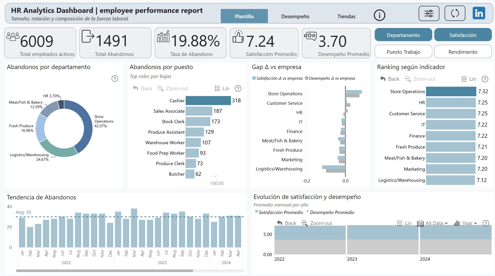
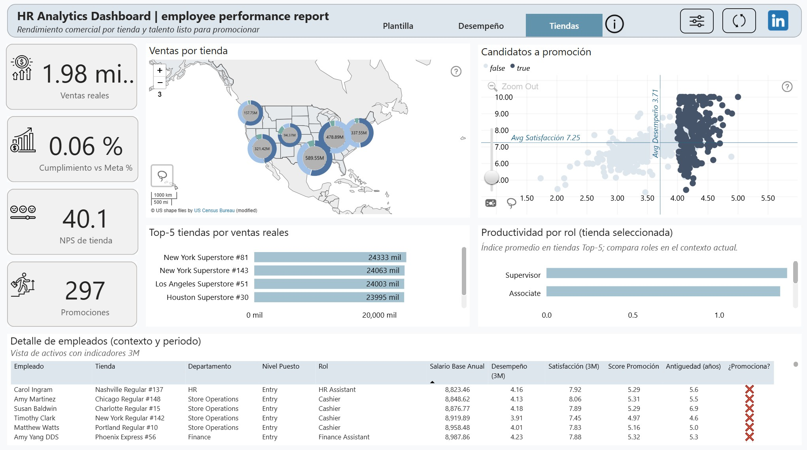
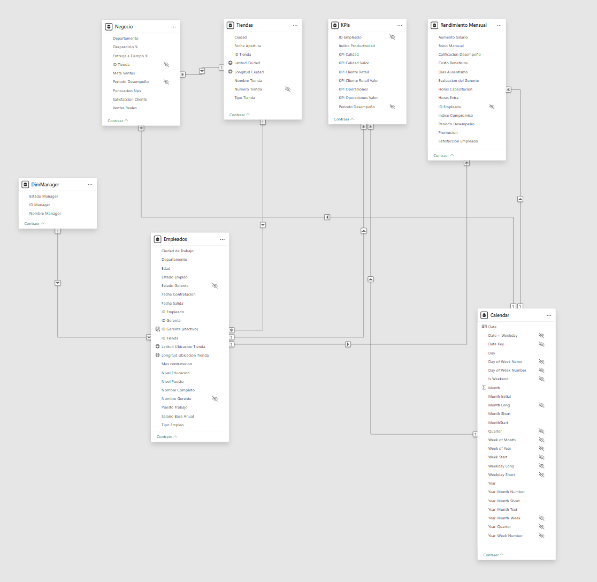

# 💼 HR Analytics — Workforce & Performance  
**Connecting people metrics with business outcomes.**

Interactive Power BI report designed to analyze workforce trends, employee satisfaction, turnover, and performance alignment with business results.  
The goal: to reveal patterns that drive retention and productivity across departments, roles, and stores.

---
## 🧩 Problem Statement

Improve employee satisfaction, retention, and performance while staying aligned with business results.  
The report identifies where attrition concentrates, which factors explain performance, and how people metrics relate to store and department outcomes to prioritize HR actions.

---

## 🔍 Key Points

### 1. **Baseline & Segmentation**
Historical attrition (~1.5K leavers; ~19.9% turnover) concentrates in frontline roles and shows seasonality in the monthly series → plan staffing buffers for peak months.

### 2. **Performance Drivers**
Training correlates positively with performance; age and base salary show weaker relationships → prioritize training & recognition for top managers/teams.

### 3. **Manager / Area Gaps**
Persistent differences in satisfaction and performance by area/manager → target coaching, staffing, and workload balancing.

### 4. **Promotion Pipeline**
Promotion candidates cluster where **high performance + high satisfaction (3M)** co-exist → practical, low-friction criterion for eligibility and career planning.

### 5. **Store Lens**
Leading stores combine strong NPS and productivity; Top-5 capture a disproportionate share of sales → replicate their playbooks.

---

## 🧭 Report Overview

- **Page 1 — Workforce Overview & Segmentation:**  
  Headcount, leavers, turnover rate, satisfaction, and performance.  
  Filter by department, role, or month to detect hotspots and seasonality.

  

- **Page 2 — Performance Drivers:**  
  Top-performing managers and employees; relationships between training hours, age, and base salary with performance.  
  Departmental rankings driven by selected factors (Salary / Age / Training).

  

- **Page 3 — Stores & Talent Pipeline:**  
  Store map and Top-5 ranking by sales and satisfaction.  
  Promotion candidates (high performance + high satisfaction, “3M”) and productivity by role in the current context.
  
  
---

## 🧠 Tools & Technologies
- **Power BI Desktop** (English UI)  
- **Power Query** – Data cleaning & standardization  
- **DAX** – Calculated measures, KPIs, dynamic tooltips  
- **ZoomCharts Drill Down PRO** – Advanced drill interactions   
- **Excel (supporting preprocessing)**  

### 💡 Skills Demonstrated
- Data modeling and relationship design (star schema)  

- DAX measures for dynamic KPIs and conditional comparisons  
- Dashboard storytelling and UX consistency  
- Analytical translation of HR indicators into performance insights

### 🧩 Technical Summary
Built a **three-page Power BI report** using a clean, relational **star schema** integrating employee, performance, and store data.  
The model combines:
- **Fact tables:** `Rendimiento Mensual` (monthly performance metrics). 
- **Dimension tables:** `Empleados`, `Tiendas`, `Negocio`, `DimManager`,`KPIs` (aggregated indicators) and `Calendar`

Key relationships:  
Employees link to managers (`DimManager`), stores (`Tiendas`), and performance records (`Rendimiento Mensual`).  
The calendar dimension controls all time-based calculations.

Data was prepared in **Power Query** — normalizing IDs, ensuring unique keys, standardizing departments, handling nulls, and creating flags for active employees and exits.  
In **DAX**, measures were developed for:
- Turnover rate (based on active vs. exited employees)  
- Average satisfaction and performance ratings  
- Departmental/manager gaps vs. company averages  
- KPIs by role and store type (e.g., productivity, NPS, on-time delivery)

Field Parameters enable switching between dimensions (e.g., *Department / Role / Manager / Store Type*) for flexible comparisons.  
Each report page integrates cross-filtering, drill-through navigation, and dynamic tooltips to enhance interpretability and flow.  

The focus was turning HR data — satisfaction, turnover, training, performance, and store KPIs — into **actionable insights aligned with business outcomes.**

---

## 📊 Conclusions

✔️ Focus on **high-volume roles** to cut attrition where impact is largest.  
✔️ **Invest in training** — clearest lever for performance improvement.  
✔️ Address **manager/area gaps** to lift performance **and** employee sentiment.  
✔️ Use **high performance + high satisfaction (3M)** as a promotion readiness signal.  
✔️ In stores, focus on **NPS + productivity** to replicate top-performing locations.

---

## 💬 Final Reflection

The dashboard turns HR metrics into action: benchmark segments against a baseline, drill into causes (roles, departments, stores), and translate findings into HR levers (training, promotions, staffing, recognition) and operational levers (role productivity, in-store experience).  
It aligns **people metrics** with **business impact**, helping decision-makers act with clarity and confidence.

## 📈 Dashboard Preview

*Interact directly with the dashboard in Power BI Service.*

https://app.powerbi.com/view?r=eyJrIjoiYmViN2VhZTYtMzMxYy00YWY3LTlmYjUtYjA4M2VkMzIxZGNiIiwidCI6IjQ2NTRiNmYxLTBlNDctNDU3OS1hOGExLTAyZmU5ZDk0M2M3YiIsImMiOjl9

📊 **Dashboard built with:** Power BI, DAX, Power Query, ZoomCharts PRO  
✉️ *Created by Jessica Herrera — Data Analyst | Power BI | SQL | Python*

✍️ Thanks for checking out this project!
For more information, suggestions, or feedback, please feel free to contact me or visit my profile:
- 
- 

---
